# Contributing to dango

This document is for contributors and maintainers. It covers architecture context, repository structure, development workflow, and documentation/code conventions.

## Architecture Overview

`dango` is a three-tier orchestration design:

- Tier 1 (`orchestrator`): planning, registry, DAG/task coordination
- Tier 2 (`scheduler`): runtime execution dispatch and edge lifecycle tracking
- Tier 3 (`executor`): tool-facing `describe` and `run` contract

Current implementation includes a local runnable demo path and preserves extension points for production planners/models and remote storage backends.

The diagram below gives contributors a high-level view of how the orchestrator, scheduler, executor, storage, and tool runtime pieces fit together.



## Repository Structure

```text
cmd/dango/                 binary entrypoint
internal/cli/              CLI parsing and top-level wiring
internal/spec/             shared domain contracts and validation
internal/layout/           data-dir path helpers
internal/store/sqlite/     SQLite migrations, sqlc query definitions, and persistence
internal/runtime/          runtime abstraction (Docker + host demo)
internal/orchestrator/     registry, planner, scheduler, engine, HTTP server
internal/executor/         executor describe/run implementation
```

Go source is organized for reviewer navigation:

- Keep each primary exported type with its constructor/methods in the package's main file.
- Move distinct helper responsibilities into focused companion files (for example `runtime_context.go`, `tool_spec.go`, `handoff.go`).
- Keep one package overview per package in `doc.go`.

## Development Workflow

Build and test:

```bash
go test ./...
```

Regenerate SQLite query wrappers after editing `internal/store/sqlite/queries.sql`
or `internal/store/sqlite/schema.sql`:

```bash
go run github.com/sqlc-dev/sqlc/cmd/sqlc@latest generate
```

Add new SQLite schema changes as numbered migration pairs under
`internal/store/sqlite/migrations/` using `.up.sql` and `.down.sql` files.

Run the demo:

```bash
go run ./cmd/dango orchestrator demo-run \
  --data-dir ./.dango-demo \
  --request "Write a short project status update"
```

Run the HTTP server:

```bash
go run ./cmd/dango orchestrator serve --data-dir /tmp/dango-data
```

## Documentation Boundaries

- Keep `README.md` user-facing: purpose, usage, examples, quick start.
- Keep `CONTRIBUTING.md` developer-facing: structure, architecture, workflow, conventions.

## Coding and Documentation Rules

Repository-specific rules live in `.github/instructions/`:

- `go-file-organization.instructions.md`
- `go-docs.instructions.md`
- `repository-doc-boundaries.instructions.md`

`AGENTS.md` and `CLAUDE.md` point to these files as canonical guidance.

## Security and Local Secrets

- `.env` and `.env.*` are git-ignored.
- Keep local model keys (for example OpenRouter keys) in untracked env files only.
