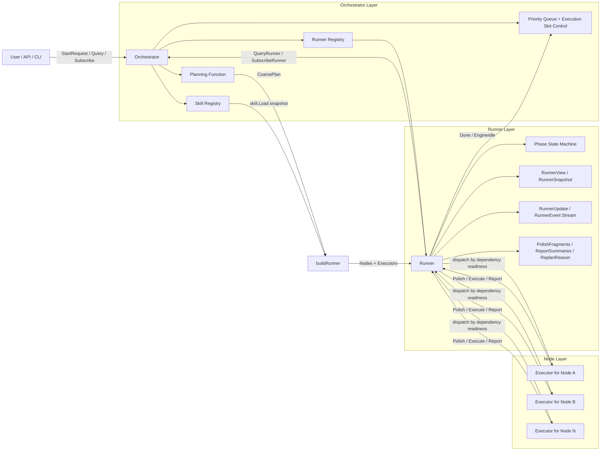
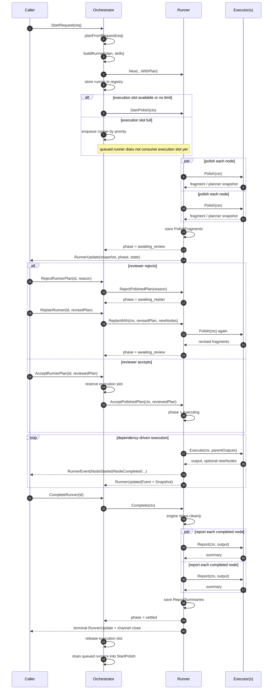

# Orchestrator / Runner / Executor 架构说明

这套编排模型可以拆成三个层次：

- `Orchestrator` 负责请求入口、技能注册、粗粒度 plan 装配、执行槽位控制、队列调度，以及对外查询 / 订阅接口。
- `Runner` 负责单个 plan 的生命周期推进。它把一个 plan 从 `created -> polishing -> awaiting_review -> executing -> report -> settled` 推进下去，并维护事件流、快照、阶段状态、报告摘要等运行时信息。
- `Executor` 负责单个 node 的节点级逻辑。它只暴露三个动作：`Polish`、`Execute`、`Report`，由 Runner 在不同 phase 调用。

换句话说：

- `Orchestrator` 决定“这个请求要不要接、什么时候开始、什么时候占用执行资源”。
- `Runner` 决定“这个 plan 当前处于哪个阶段、节点怎么跑、事件怎么广播、结果怎么汇总”。
- `Executor` 决定“某一个节点具体怎么补全计划、怎么执行、怎么产出摘要”。

## 整体分层

## 调用与信息同步 Workflow

下面这张图描述的是当前 phased control 下最完整的一条 happy path，同时保留 reject / replan 分支。

## 三者之间的职责边界

### 1. Orchestrator 是控制面，不是执行面

`Orchestrator` 不直接执行节点。它负责：

- 接收 `StartRequest`，校验 request priority。
- 调用 planning function，把 request 映射成 `CoarsePlan` 或 `RejectReason`。
- 用技能注册表把 `CoarsePlanNode` materialize 成 `Runner + Node + Executor` 图。
- 管理 `runners` 注册表、`runningRunnerIDs`、优先级队列和 execution slot。
- 对外暴露 `QueryRunner` / `SubscribeRunner` / `CompleteRunner` / `RejectRunnerPlan` / `ReplanRunner` 等控制接口。

因此，Orchestrator 最关心的是“什么时候能开始”和“外界怎么看到 runner 的状态”，而不是某个 node 具体怎么跑。

### 2. Runner 是 plan 的生命周期宿主

`Runner` 既是状态机，也是事件总线。它负责：

- 持有 plan、initial nodes、snapshot、phase、state。
- 在 `StartPolish` 中并发调用所有 executor 的 `Polish`。
- 在 `AcceptPolishedPlan` 之后启动执行引擎，按依赖关系驱动节点执行。
- 在执行过程中持续发布 `RunnerEvent` 和更高层的 `RunnerUpdate`。
- 在 `Complete` 之后进入 `report` 阶段，再收集 `ReportSummaries`，最终进入 `settled`。

对外观察 runner 时，最重要的是区分两套状态：

- `RunnerPhase` 表示业务阶段，例如 `awaiting_review`、`executing`、`settled`。
- `RunnerStatus` 表示引擎状态，例如 `pending`、`running`、`idle`、`failed`。

### 3. Executor 是节点局部逻辑单元

每个 `Executor` 只对一个 node 负责：

- `Polish(ctx)` 产出该节点的预览 / 计划片段，供 review 使用。
- `Execute(ctx, parentOutputs)` 消费上游输出，执行节点主逻辑，并可返回新的 node。
- `Report(ctx, output)` 把节点执行输出变成摘要，供最终展示或归档使用。

这意味着 `Executor` 不关心全局调度，也不关心 execution slot；它只关心“当前节点在这个阶段该返回什么”。

## 信息是如何同步的

### 自上而下：控制命令

调用方向是：`Caller -> Orchestrator -> Runner -> Executor`。

典型控制命令包括：

- `StartRequest`：创建 runner 并启动 `StartPolish` 或入队。
- `AcceptRunnerPlan`：保留 execution slot 后进入执行。
- `RejectRunnerPlan`：把 runner 推回 `awaiting_replan`。
- `ReplanRunner`：替换 plan 和 node graph，然后重新 polish。
- `CompleteRunner`：要求 runner 从 executing 协作式收尾，并进入 report / settled。

### 自下而上：状态与事件回流

信息回流方向是：`Executor -> Runner -> Orchestrator -> Caller`。

同步面主要有三类：

- 运行阶段同步：`RunnerPhase` 与 `RunnerState` 组合成 `RunnerView`。
- 事件同步：节点开始 / 完成 / 失败、引擎 idle / stopped 会变成 `RunnerEvent`，再被包装进 `RunnerUpdate`。
- 生命周期产物同步：`PolishFragments`、`ReportSummaries`、`ReplanReason` 都保存在 runner 上，供 orchestrator 或调用方读取。

### Orchestrator 如何感知 Runner 已释放资源

执行槽位不是靠调用方手工归还，而是通过 `watchRunnerDone` 观察 runner 更新：

- 只有 `PhaseExecuting` 才算真正占用 execution slot。
- 当 runner 发出 `EngineIdle`，或 `Done()` / update stream 关闭时，Orchestrator 会释放该 runner 的 execution slot。
- 释放槽位后，Orchestrator 会从优先级队列中继续调度下一个 queued runner 进入 `StartPolish`。

这也是当前实现里最重要的边界：

- `awaiting_review` 不占槽位。
- `queued -> polishing -> awaiting_review` 这一段也不占槽位。
- 只有 `AcceptRunnerPlan` 之后真正进入 `executing` 才占槽位。

## 一句话总结

如果把三者看成一个协作链路：

- `Orchestrator` 负责“组织与调度”。
- `Runner` 负责“推进生命周期并同步状态”。
- `Executor` 负责“完成单个节点的具体工作”。

所以最准确的理解方式是：`Orchestrator` 驱动 `Runner`，`Runner` 编排多个 `Executor`，而所有对外可见的信息都先汇总到 `Runner`，再由 `Orchestrator` 暴露给调用方。
