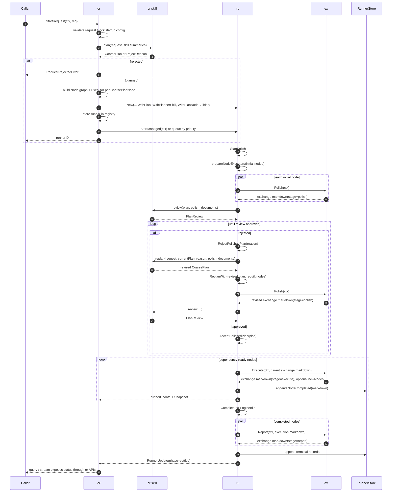
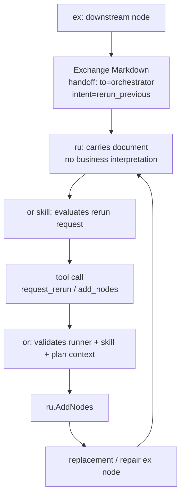
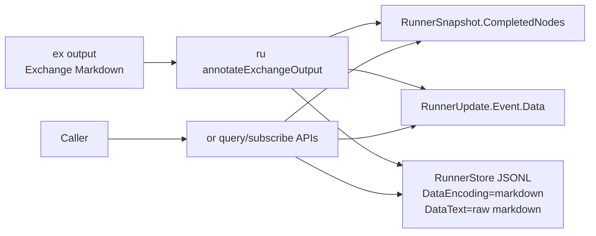

# Orchestrator / Runner / Executor 架构说明

这份文档描述 `internal/engine/orchestrator.go`（简称 `or`）、`internal/engine/runner/runner.go`（简称 `ru`）和 `internal/engine/executor.go`（简称 `ex`）之间的调用关系和数据流关系。

当前设计把三者分成两条正交链路：

- 管理调用关系：`or` 对外接受 request，生成 coarse plan，装配并启动 `ru`；`ru` 维护单个 plan 的生命周期并调度多个 `ex`；上层程序只通过 `or` 查询和订阅 request 的处理状态，不需要感知 `ru` 和 `ex`。
- 数据流关系：skill 间的数据交换统一收敛为带 front matter 的 markdown exchange document。`ru` 只负责搬运、补齐 runner/node 元数据、持久化和转发这些文档，不解释 skill 业务语义。

## 调用关系

`or` 是外部控制面，`ru` 是单个 request/plan 的生命周期宿主，`ex` 是单个 node 的执行单元。

```mermaid
flowchart TB
    Caller[User / API / CLI]

    subgraph OR["or: Orchestrator"]
        Start[StartRequest]
        Query[QueryRunner / SubscribeRunner / LoadRunnerRecords]
        SkillRegistry[Skill Registry\nlightweight skills + AddSkillConfig]
        OrSkill[Orchestrator Skill\nplan / review / replan]
        Build[buildPlanNodes / newRunnerFromPlan]
        Queue[Priority Queue\nmaxRunningRunners]
        Registry[Runner Registry]
    end

    subgraph RU["ru: Runner"]
        Managed[StartManaged]
        Phases[created -> polishing -> awaiting_review\n-> executing -> report -> settled]
        Bind[prepareNodeExecutors\nBindForRunner + session reuse]
        DAG[DAG Engine\nAddNodes + dependency readiness]
        Snapshot[RunnerView / RunnerUpdate / RunnerSnapshot]
    end

    subgraph EX["ex: Executor(s)"]
        Polish[Polish]
        Execute[Execute]
        Report[Report]
    end

    Caller -->|StartRequest(req)| Start
    Caller -->|query / subscribe| Query
    Start --> OrSkill
    OrSkill -->|CoarsePlan or RejectReason| Start
    SkillRegistry --> Build
    Start --> Build
    Build -->|Runner + Node graph| Registry
    Registry --> Queue
    Queue -->|start when admitted| Managed
    Managed --> Phases
    Phases --> Bind
    Phases -->|polishing| Polish
    Phases -->|executing| DAG
    DAG -->|ready node| Execute
    Phases -->|report| Report
    Snapshot --> Registry
    Registry --> Query
    Query -->|RunnerView / RunnerUpdate| Caller
```

关键边界：

- `or` 管外部 API、skill 注册、coarse plan 生成、runner 装配、runner registry、query/subscribe、队列和启动准入。
- `ru` 管单个 plan 的生命周期、executor binding、DAG 调度、dynamic node append、snapshot/update/event、report 汇总和终态。
- `ex` 管单个 node 在 `Polish`、`Execute`、`Report` 三个阶段的局部工作。

## 数据流关系

`ex` 的默认输出不再是任意 Go 值，而是 markdown exchange document。这个文档可以落库、落本地文件，也方便 human review 和 skill 继续消费。

每个 exchange document 使用 YAML front matter 描述路由和元数据，正文固定分为三段：

- `Memo`：长任务、多阶段任务的自主规划、进度和状态记录。
- `Reasoning`：human-debuggable 的推理摘要；如果 runtime skill 没有显式写入，`ex` 会尝试从 reasoning turn 补齐。
- `Handoff`：传递给目标 recipient 的输出、接力建议或请求。

```mermaid
flowchart LR
    subgraph Input["Planning Input"]
        Req[Request]
        Skills[Skill summaries]
    end

    subgraph OR["or"]
        OrSkill[Orchestrator Skill]
        Plan[CoarsePlan]
        NodeGraph[Node graph\nNode metadata + Executor]
    end

    subgraph RU["ru"]
        PolishDocs[PolishDocuments\nmap[nodeID]markdown]
        Outputs[CompletedNodes\nmap[nodeID]markdown]
        Reports[ReportSummaries\nmap[nodeID]markdown]
        Store[RunnerStore\nJSONL records]
        Updates[RunnerUpdate stream]
    end

    subgraph EX["ex"]
        ExPolish[Polish -> Exchange Markdown]
        ExRun[Execute(parent markdown) -> Exchange Markdown]
        ExReport[Report(output markdown) -> Exchange Markdown]
    end

    Req --> OrSkill
    Skills --> OrSkill
    OrSkill -->|plan JSON| Plan
    Plan --> NodeGraph
    NodeGraph --> ExPolish

    ExPolish -->|kind=dango.exchange\nstage=polish| PolishDocs
    PolishDocs -->|markdown docs, not runner internals| OrSkill
    OrSkill -->|review JSON: approved/reason| RUReview{approved?}
    RUReview -->|false| OrSkill
    OrSkill -->|replan JSON| Plan
    RUReview -->|true| ExRun

    Outputs -->|parentOutputs by dependency| ExRun
    ExRun -->|kind=dango.exchange\nstage=execute| Outputs
    ExRun -->|optional newNodes| NodeGraph
    Outputs --> Store
    Outputs --> Updates

    Outputs --> ExReport
    ExReport -->|kind=dango.exchange\nstage=report| Reports
    Reports --> Store
    Reports --> Updates
```

这里的重点是：`ru` 不需要理解 `Memo`、`Reasoning`、`Handoff` 的业务含义。它只做四件事：

- 接收 `ex` 返回的 exchange markdown。
- 为 exchange markdown 补齐 `runner_id`、`node_id`、`skill_name`、`task_description` 等元数据。
- 把 markdown 作为 node output、polish document 或 report summary 继续传递。
- 在持久化事件时把 exchange markdown 标记为 `data_encoding=markdown`，避免把 human-readable 数据降级成 JSON 字符串。

## Lifecycle Sequence

下面是当前 managed lifecycle 的端到端时序。对外入口只有 `or.StartRequest`；后续 polish、review、replan、execute、report 由 `ru.StartManaged` 推进。



## Exchange Document Shape

示例：

```markdown
---
kind: dango.exchange
version: 1
stage: execute
runner_id: runner-123
node_id: summarize
skill_name: summarizer
task_description: Summarize the collected findings.
handoffs:
  - to: downstream
    intent: continue
    summary: Use this summary as downstream context.
---

## Memo

Progress and durable task state.

## Reasoning

Human-debuggable reasoning summary.

## Handoff

Recipient-facing output and next-step advice.
```

当前约定的 recipient / intent：

- `to: orchestrator`, `intent: review`：交给 or skill 做 plan review。
- `to: orchestrator`, `intent: summarize`：交给 or skill 或最终汇总阶段消费。
- `to: orchestrator`, `intent: rerun_previous`：请求 or skill 评估是否需要让前置 executor 修改参数并重新执行。
- `to: downstream`, `intent: continue`：交给后续依赖节点作为 parent output。

## 特殊路径：要求前置 Executor 重跑

常规数据流中，`ru` 不解释 skill 输出，只把 exchange markdown 传给下一阶段。唯一需要跨回控制面的特殊情况是：某个 `ex` 判断前置 `ex` 的参数需要调整并重新执行。

这条路径的设计是由 `ex` 在 exchange document 中写出 `to: orchestrator`、`intent: rerun_previous` 的 handoff；orchestrator skill 评估后，通过工具调用进入 `or` 控制面，由 `or` 定位目标 runner 并调用 `ru.AddNodes` 追加修正节点。



当前 PR 已落地 exchange document、`rerun_previous` intent 常量和 markdown 数据面；`or` skill 的 tool call 到 `ru.AddNodes` 是下一步控制面接入点。

## 持久化和可观察性

`RunnerStore` 继续使用 append-only JSONL runner record。变化点是 node output 如果是合法 exchange markdown，会以 `data_encoding=markdown` 存入 `StoredRunnerEvent.DataText`，而不是作为普通 JSON string 存入 `DataJSON`。



这让同一份数据可以同时满足三种需求：

- 数据库存储：front matter 是稳定 metadata，markdown 正文保留 human-readable 内容。
- 本地文件存储：exchange document 可以直接落成 `.md`。
- skill 间传递：后续 skill 可以直接读取 parent output markdown，不需要理解 `ru` 内部结构。

## 一句话总结

`or` 负责对外和控制面，`ru` 负责单个 plan 的生命周期和 DAG 调度，`ex` 负责单个 node 的执行；三者之间的数据面统一使用带 front matter 的 markdown exchange document，让持久化、human review 和 skill handoff 使用同一种格式。
