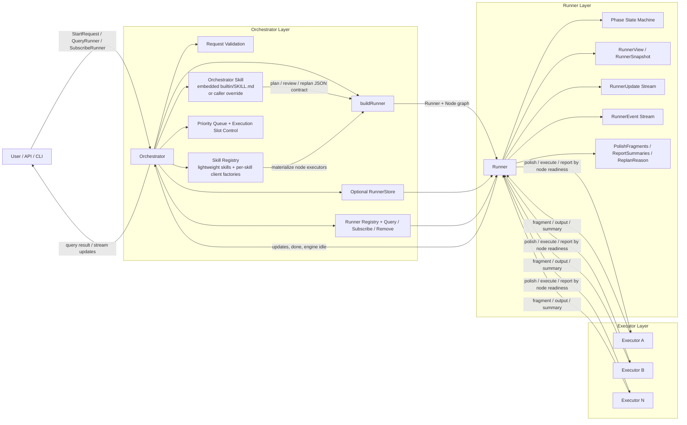
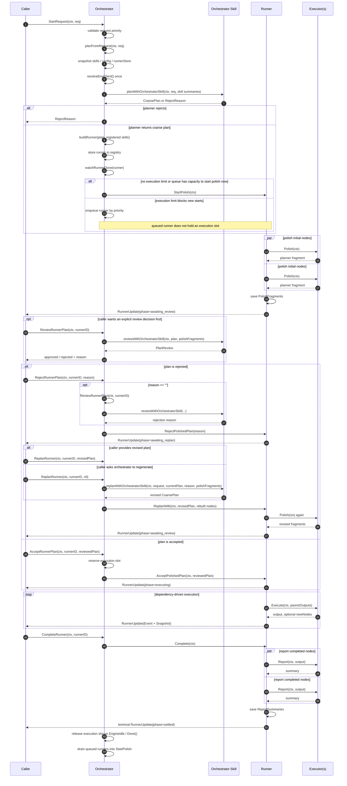

# Orchestrator / Runner / Executor 架构说明

当前这套编排实现由三个明确分层组成。

但这轮 PR 的直接目标不是一次性把 skill prompt、skill memory/memo 等后续能力全部实装完，而是先把调用流程一步一步拉直：补上缺失的生命周期动作，修正错误的控制边界，并把 `Orchestrator`、`Runner`、`Executor` 之间需要长期稳定的 interface 和 struct 先对齐。这样下一阶段在 skill 内真正落 prompt、补 memory/memo 能力时，底层控制流和数据形状不需要再大改。

从这个角度看，这轮 PR 更像是一个“对齐层”的改造，重点是三件事：

- 让 request -> plan -> polish -> review -> replan -> execute -> report 这条主链路语义闭合。
- 把 review / reject / replan / execution-slot 这些之前缺失或不清晰的边界补完整。
- 把后续 skill runtime 真正依赖的核心接口和数据结构先收敛稳定。

在这个前提下，下面的架构图应该理解为“当前代码已经对齐到的调用骨架”，而不是“skill prompt / memo 系统已经完整落地后的最终形态”：

- `Orchestrator` 是控制面。它负责请求入口、skill 注册、在实例化时初始化自己的 orchestrator-owned skill（包括尽早绑定可用的 LLM client）、通过该 skill 做 plan / review / replan、runner 装配、execution slot 控制、队列调度，以及 query / subscribe / persistence 入口。
- `Runner` 是单个 plan 的生命周期宿主。它把 plan 从 `created -> polishing -> awaiting_review -> awaiting_replan -> executing -> report -> settled` 推进下去，并维护更新流、快照、事件、`PolishFragments`、`ReportSummaries`、`ReplanReason` 等运行时状态。
- `Executor` 是单个 node 的局部执行单元。它实现 `Polish`、`Execute`、`Report` 三个动作，由 Runner 在不同 phase 调用。

换句话说：

- `Orchestrator` 决定“这个请求能不能被规划、什么时候开始 polish、什么时候允许进入 executing”，并且从实例化开始就持有一份可直接参与 orchestrator 级决策的 skill。
- `Runner` 决定“这个 plan 当前在哪个生命周期阶段、节点怎么推进、对外暴露哪些状态与事件”。
- `Executor` 决定“某一个节点在当前阶段具体返回什么”。

## 整体分层

## 调用与信息同步 Workflow

下面这张图描述的是当前实现里已经被拉通的主路径：请求先通过 orchestrator skill 生成 coarse plan，Runner 完成 polish，随后进入 review / reject / replan / accept / execute / report / settled。这里强调的是控制流和数据边界已经对齐，不代表下一阶段要补的 prompt 细化、skill memory/memo 等能力已经全部完成。

## 三者之间的职责边界

### 1. Orchestrator 是控制面，也是 orchestrator skill 的宿主

当前实现里的 `Orchestrator` 不再依赖外部 `planning function`。planning、review、replan 现在都通过同一个 orchestrator-owned skill 完成。这里的重点是先把 orchestrator 级控制流和输入输出 contract 对齐，而不是在这一轮就把所有 skill 内部 prompt/runtime 能力做满：

- 默认 skill 来自编译时 embed 的 `internal/orchestrate/builtin/SKILL.md`，通过 `skill.NewFromFS` 初始化，并在 `Orchestrator` 实例化时就尝试绑定到当时可用的 env-derived LLM client。
- 调用方可以在 startup 阶段通过 `SetOrchestratorSkill` 或 `SetOrchestratorSkillDir` 覆盖它。
- 如果调用方传入的是 lightweight skill，startup 阶段也会按同样的初始化语义优先绑定可用的 orchestrator client。
- `StartRequest` 会调用 `planFromRequest(ctx, req)`，由 `planWithOrchestratorSkill` 返回 `CoarsePlan` 或 `RejectReason`。
- `ReviewRunnerPlan` 会调用 `reviewWithOrchestratorSkill(...)`。
- `ReplanRunner(ctx, id, nil)` 会调用 `replanWithOrchestratorSkill(...)` 自动生成 revised plan。

除此之外，Orchestrator 还负责：

- startup-only 配置：`SetLogger`、`SetOrchestratorSkill`、`SetOrchestratorSkillDir`、`SetRunnerStore`、`SetMaxRunningRunners`。
- runtime 可变注册表：`RegisterSkill` / `RemoveSkill`。
- 把 `CoarsePlanNode` materialize 成 `Runner + Node + Executor` 图。
- 管理 `runners`、`runningRunnerIDs`、优先级队列和 `watchRunnerDone`。
- 对外暴露 `QueryRunner`、`SubscribeRunner`、`LoadRunnerRecords`、`RemoveRunner`、`ReviewRunnerPlan`、`AcceptRunnerPlan`、`RejectRunnerPlan`、`ReplanRunner`、`CompleteRunner` 等控制面 API。

因此，Orchestrator 最关心的是：

- 请求是否能被规划。
- 哪些 runner 可以开始 polish。
- 哪些 runner 可以占用 executing slot。
- 外界如何查询和观察 runner。

### 2. Runner 是 plan 的生命周期宿主

`Runner` 是真正承载 plan 生命周期的状态机。它的职责包括：

- 持有 `CoarsePlan`、initial node graph、`RunnerState`、`RunnerPhase`、`RunnerSnapshot`。
- 在 `StartPolish` 中并发调用所有 node executor 的 `Polish`。
- 在 `AcceptPolishedPlan` 之后启动执行引擎，按依赖关系调度 `Execute`。
- 在 `RejectPolishedPlan` 时记录 `ReplanReason` 并进入 `awaiting_replan`。
- 在 `ReplanWith` 时替换 plan 和 nodes，然后重新进入 `polishing`。
- 在 `Complete` 后进入 `report`，汇总 `ReportSummaries`，最终进入 `settled`。

当前实现里的 phase 含义是：

- `created`：Runner 刚构建完成，还没开始 polish。
- `polishing`：并发采集每个节点的 planner fragment。
- `awaiting_review`：已经拿到 `PolishFragments`，等待 review / accept / reject。
- `awaiting_replan`：review 被 reject，等待新 plan。
- `executing`：DAG 引擎正在执行节点。
- `report`：对已完成节点并发调用 `Executor.Report`。
- `settled`：生命周期终态。

这里要特别区分两套状态：

- `RunnerPhase` 表示 plan 所处的业务阶段。
- `RunnerStatus` 表示引擎级运行状态，例如 `pending`、`running`、`idle`、`failed`、`canceled`。

### 3. Executor 是节点级局部逻辑单元

每个 `Executor` 只服务一个 node。对 Runner 来说，它只需要实现：

- `Polish(ctx)`：返回该节点的 planner fragment，供 review / replan 使用。
- `Execute(ctx, parentOutputs)`：消费依赖节点输出，返回节点主输出，并可动态追加新 nodes。
- `Report(ctx, output)`：把节点输出转成最终摘要。

当前 `Executor` 还有一个实现细节值得写清：它持有的是 skill 的“运行时绑定逻辑”，而不是只持有一份静态 prompt 文件。也正因为如此，这轮 PR 先把 skill 初始化、绑定边界、client 选择顺序、runner 调用面收敛稳定，后面再继续往 skill prompt / memo 能力上填内容会更自然。

- `skill.NewFromDir` / `skill.NewFromFS` 只负责读取 `SKILL.md`、保存 skill workspace `fs.FS`、bash allow/block 和 tools；它们不会创建 LLM client 或 conversation。
- 注册到 orchestrator 里的通常是这种 lightweight skill，本地目录注册会在初始化时把目录内置工具一并放进 skill。
- 真正运行前，executor 会调用 `Skill.Bind(client, conversationConfig, sessionID, stores...)` 把 skill bind 成 runnable skill。
- client 解析优先级是：环境变量缓存 client -> skill 自带 client -> per-skill client factory -> orchestrator fallback client。
- `Bind` 的 client 为 nil 时会从环境构造 client；本地目录 skill 如果有自己的 `.env`，会优先把该 `.env` 作为 env source。
- `Bind` 的 session store 为空时 conversation 只存在于内存中；有 store 时，nil session id 会自动创建新 id，显式 session id 必须已经存在；多个 store 会同时写入同一份 event log。

因此，Executor 不关心全局 queue、slot、review 状态；它只关心“这个 node 在当前阶段应该如何返回 fragment / output / summary”。

## 信息是如何同步的

### 自上而下：控制命令

调用方向仍然是：`Caller -> Orchestrator -> Runner -> Executor`。

当前最关键的控制入口包括：

- `StartRequest(ctx, req)`：规划请求、构建 runner，并决定立即 `StartPolish` 还是进入队列。
- `ReviewRunnerPlan(ctx, id)`：调用 orchestrator skill 返回 review decision。
- `AcceptRunnerPlan(ctx, id, plan)`：保留 execution slot，然后让 runner 进入 executing。
- `RejectRunnerPlan(ctx, id, reason)`：把 runner 推回 `awaiting_replan`。
- `ReplanRunner(ctx, id, plan)`：替换 plan / nodes，并重新 polish；当 `plan == nil` 时会自动调用 orchestrator skill 生成 revised plan。
- `CompleteRunner(ctx, id)`：协作式结束 executing，进入 report / settled。

### 自下而上：状态与事件回流

信息回流方向是：`Executor -> Runner -> Orchestrator -> Caller`。

当前主要有三层同步面：

- 生命周期状态：`RunnerPhase` + `RunnerState` 组成 `RunnerView`。
- 流式更新：`Runner.SubscribeUpdates` 产出 `RunnerUpdate`，其中可带 `RunnerEvent`。
- 生命周期产物：`PolishFragments`、`ReportSummaries`、`ReplanReason` 都保存在 Runner 上，由 Orchestrator 暴露给调用方。

低层 `RunnerEvent` 目前包括：

- `NodeAdded`
- `NodeStarted`
- `NodeCompleted`
- `NodeFailed`
- `EngineIdle`
- `EngineStopped`

这些事件会和 snapshot 一起被包装到更高层的 `RunnerUpdate` 里，用于 query / subscribe 消费。

### Orchestrator 如何感知 Runner 已释放 execution slot

execution slot 的边界在当前实现里非常明确：

- `queued` 不占 slot。
- `polishing` 不占 slot。
- `awaiting_review` 不占 slot。
- `awaiting_replan` 不占 slot。
- 只有 `AcceptRunnerPlan` 成功后进入 `executing` 才占 slot。

Orchestrator 通过 `watchRunnerDone` 感知 slot 释放：

- 它订阅 `RunnerUpdate`，只在看到 runner 进入 `PhaseExecuting` 后开始认为该 runner 占用 slot。
- 当执行中的 runner 发出 `EventEngineIdle` 时，Orchestrator 会释放 slot。
- 如果 `Done()` 关闭或 update stream 提前结束，Orchestrator 也会兜底释放 slot。
- slot 释放后，Orchestrator 会从优先级队列里继续调度下一个 queued runner 进入 `StartPolish`。

这也是当前调度语义里最容易误解、但最关键的地方：

- queue 的限制是“什么时候允许一个 runner 开始进入系统的下一段生命周期”。
- 真正被限流的资源是 `executing` 阶段，而不是 `awaiting_review` 之前的阶段。

## 当前实现的一句话总结

如果把三者看成一条协作链路：

- `Orchestrator` 负责“用 orchestrator skill 做控制面决策，并管理 runner 的进入与执行资源”。
- `Runner` 负责“推进单个 plan 的生命周期，并把所有状态与产物汇总成 query / update surface”。
- `Executor` 负责“完成单个节点在 polish / execute / report 三个阶段的具体工作”。

最准确的理解方式是：`Orchestrator` 驱动 `Runner`，`Runner` 编排多个 `Executor`，而 planning / review / replan 又由 `Orchestrator` 自己持有的 skill 统一完成。

所以这轮 PR 的价值，不是“skill 系统已经全部完工”，而是“下一阶段真正落 skill prompt 和 memo 系统之前，调用骨架、生命周期边界、以及核心 struct/interface 已经先对齐了”。
