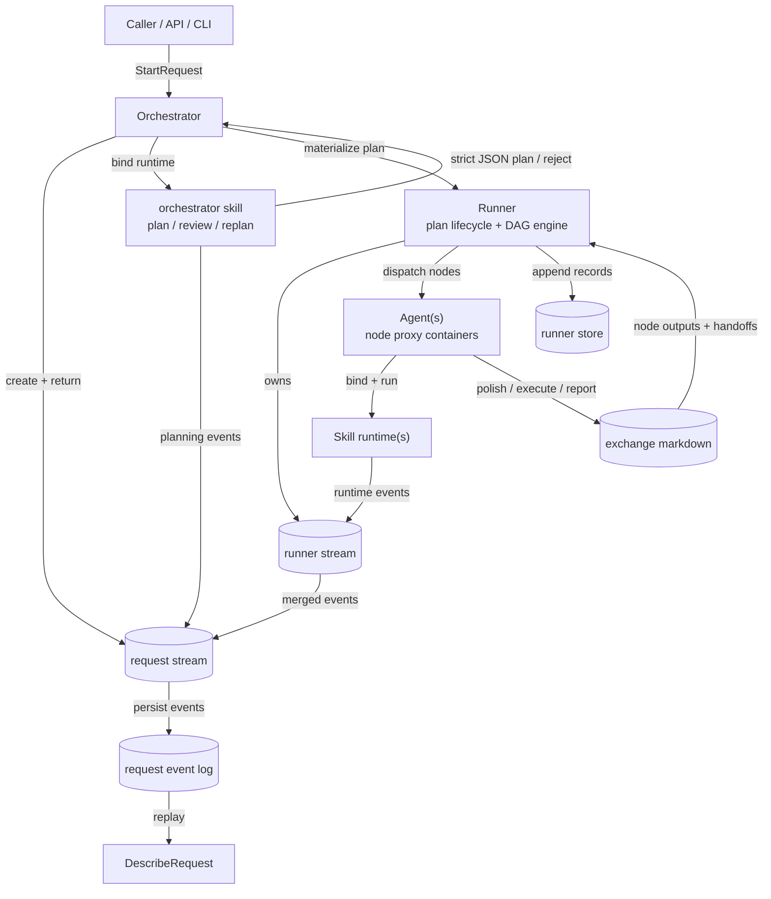

# 架构总览

这组文档描述当前 `engine` 和 `engine/runner` 的真实实现，而不是旧版单文件设计稿。对应的核心实现已经分散到 request、runner lifecycle、exchange 和 persistence 几个文件中，所以文档也按同样的边界拆开。

## 四个当前事实

- 外部入口是 `engine/request.go` 里的 `StartRequest`。它先返回 request-scoped stream，再在后台完成 planning、runner 装配和启动。
- `engine/runner` 里的 `Runner` 已经吸收旧的 managed runner 角色。现在没有单独的 `ManagedRunner` 类型，只有 bare `Start` 和 managed `StartManaged` 两种入口。
- `Agent` 不是独立运行时主体，而是一个和单个 skill 绑定的一对一代理。它负责绑定 skill runtime、补齐 node 上下文，并把 skill event stream 暴露给 runner。
- 节点之间的标准数据面是 markdown exchange document，定义在 `engine/runner/exchange_doc.go`。request stream、runner store 和 describe replay 都围绕这份文档工作。

## 核心关系图

## 代码地图

| 区域                     | 核心文件                                                                                                            | 当前职责                                                                  |
| ------------------------ | ------------------------------------------------------------------------------------------------------------------- | ------------------------------------------------------------------------- |
| request 控制面           | `engine/request.go`, `engine/orchestrator.go`, `engine/describe.go`                      | 创建 request stream、planning、runner registry、查询接口、describe replay |
| runner 生命周期          | `engine/runner/runner.go`, `engine/runner/runner_lifecycle.go`, `engine/runner/types.go` | phase machine、engine loop、managed lifecycle、snapshot                   |
| agent / skill binding | `engine/agent/agent.go`, `engine/agent/agent_prompt.go`, `engine/agent/agent_stage.go`, `engine/runner/skill_binding.go` | 绑定 skill runtime、session reuse、stage prompt / exchange 输出、skill stream merge |
| stream 基础设施          | `stream/`                                                                                           | replay、filter、merge、hub-mode bundle、scope / metadata                  |
| exchange 与持久化        | `engine/runner/exchange_doc.go`, `engine/runner/record.go`, `engine/runner/store.go`         | markdown envelope、runner record 编码、append-only store                  |

## 模块边界

- Orchestrator 负责 request 级控制面：技能注册、planning、runner 装配、request stream、live query 和 describe replay。
- Runner 负责单个 coarse plan 的生命周期：polish、review、replan、execute、report、settle，以及 runner-owned event stream。
- Agent 负责把一个 skill 放进 runner node 的执行上下文里。它自己不定义跨节点业务语义。
- Skill 是实际执行单元，拥有被 bind 后的 conversation 和 event stream。
- Stream 是运行时通信面，不只是日志通道。上层通过订阅 stream 同步状态，而不是把 `StartRequest` 或 `StartManaged` 变成阻塞等待点。

## 观察面

- request 级实时观察：`Response.Stream`
- runner 级实时观察：`Runner.EventStream()` 和 `Orchestrator.SubscribeRunnerStream`
- request 级重放视图：`Orchestrator.DescribeRequest`
- runner 级持久化记录：`Orchestrator.LoadRunnerRecords`

## 阅读顺序

1. [Request 控制面](control-plane.md)：先看 `StartRequest` 如何返回 request stream、planning 并装配 runner。
2. [Runner 生命周期](runner-lifecycle.md)：再看 `Runner` 如何驱动 polish / review / execute / report。
3. [Exchange 数据面与可观察性](data-plane.md)：最后看 markdown exchange、stream merge 和持久化如何衔接。
4. [Orchestrator / Agents exchange 编排图](orchestrator-agent_interative.md)：用更简明的工程视角看 `Orchestrator` 和 `Agents` 如何通过 exchange 分工协作。
