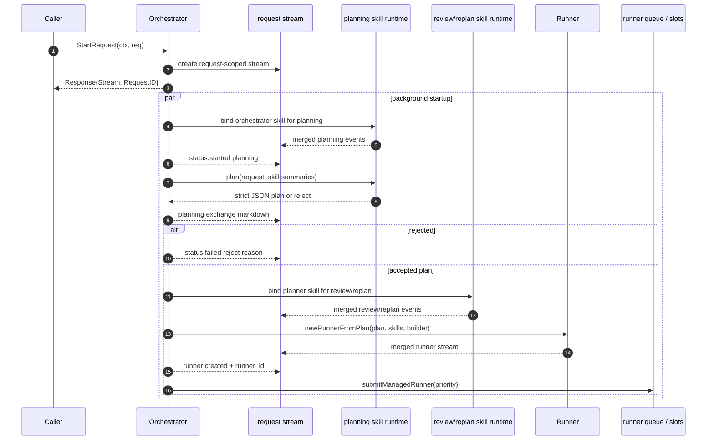

# Request 控制面

当前代码里，request 控制面不是单个文件，而是 `engine/request.go`、`engine/orchestrator.go` 和 `engine/describe.go` 三处协作完成。

## 对外入口

- `Orchestrator.StartRequest(ctx, req)`：创建 request-scoped stream，立即返回 `Response{Stream, RequestID}`。
- `Orchestrator.QueryRunner(id)`：读取 live runner view。
- `Orchestrator.SubscribeRunnerStream(id, filter, ...)`：订阅某个 runner 的 compact structured stream。
- `Orchestrator.LoadRunnerRecords(ctx, id)`：读取 runner append-only persistence log。
- `Orchestrator.DescribeRequest(ctx, requestID)`：从 request event log 重放出 describe 视图。

这里最重要的现状是：`StartRequest` 不会同步返回 `RunnerID`。`RunnerID` 只会在 request stream 上通过一次 `runner created` progress event 暴露出来。

## `StartRequest` 现在做什么

1. 校验输入并生成 `RequestID`。
2. 创建 request-scoped stream，scope 中只先带 `request_id`。
3. 如果配置了 `EventLogStore`，立刻给 request stream 挂上持久化 worker，把原始 stream event 追加到 request event log。
4. 返回 `Response{Stream, RequestID}`，不等待 planning。
5. 在后台 goroutine 里进入 `startRequestWithStream`，完成后续 planning、runner 装配和启动。

这意味着 request stream 不是 runner stream 的别名，而是一个更外层的聚合面。

## 后台启动路径

`startRequestWithStream` 的当前职责可以概括为下面几步：

1. 解析默认 LLM client，并把 orchestrator skill 绑定成 planning runtime。
2. 把 planning skill 的 event stream merge 到 request stream。
3. 发出 `orchestrator planning started` 状态事件。
4. 调用 `planWithOrchestrator` 让 orchestrator skill 返回严格 JSON：要么是 `plan`，要么是 `reject`。
5. 把 planning 结果另外包装成一份 markdown exchange document，并作为 request stream 上的一条 LLM output event 发出去。
6. 再绑定一个 runner review / replan 用的 planner skill runtime，并把它的 stream 也 merge 到 request stream。
7. 通过 `newRunnerFromPlan` 把 coarse plan 物化为 `runner.Runner` 和 node graph。
8. 把 runner 的 event stream merge 到 request stream。
9. 发出 `runner created` progress event，此时 `scope.runner_id` 和 delta 里的 `runner_id` 都已可用。
10. 交给 orchestrator 的执行槽和队列逻辑，由 `submitManagedRunner` 统一启动 managed lifecycle。

## runner 装配边界

`newRunnerFromPlan` 现在负责把 request 级信息下沉到 runner：

- `WithInitialPlan(plan, nodes)` 安装 coarse plan 和初始 node graph。
- `WithPlannerSkill(plannerSkill)` 安装 review / replan 所用的 planner skill。
- `WithSkillSummaries(skillSummaries)` 提供 replanning 可用的技能摘要。
- `WithPlanNodeBuilder(...)` 让 runner 在 replan 后能重新物化 node graph。
- `WithAllowedResourceRoots(req.ArtifactsDir)` 把 request artifact 根目录传给 runner，用于限制 downstream 资源目录放行范围。

`buildPlanNodes` 则把每个 coarse plan node 变成真正的 runner node：

- 为每个 step 构建 `ExecutionPlanner`
- 解析 skill registration
- 在需要时把 `ArtifactsDir` 加到 skill 的 accessible dirs
- 用 `NewAgent` 生成和 skill 一对一绑定的 agent

## 查询与重放

当前实现已经把 live 观察和重放观察分开：

- live request 观察走 `Response.Stream`
- live runner 观察走 `QueryRunner` 和 `SubscribeRunnerStream`
- request 级重放走 `DescribeRequest`
- runner 级持久化回放走 `LoadRunnerRecords`

`DescribeRequest` 本身不直接读 live runner，而是重放 request event log，得到一个 `DescribeView`。因此它能在进程重启后恢复 request 视角的状态，只要 event log 还在。