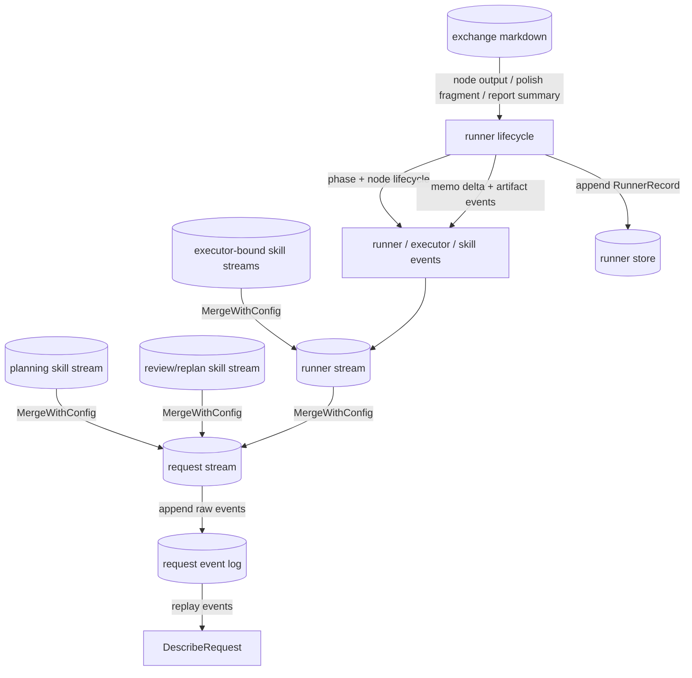

# Exchange 数据面与可观察性

当前代码里，跨 skill、跨 node、跨 request 观察面之间的共同载体已经比较统一：核心是 markdown exchange document，外围是 stream merge 和 append-only persistence。

## exchange document 是标准输出

定义位置：`internal/engine/runner/exchange.go`

一个 exchange document 由两部分组成：

- YAML front matter：放结构化元数据
- markdown 正文：固定分成 `Memo`、`Reasoning`、`Handoff` 三段

默认 stage 常量定义了三类 node 生命周期输出：

- `polish`
- `execute`
- `report`

此外，orchestrator planning 现在也会额外发一份 `stage: planning` 的 exchange markdown 到 request stream，虽然它不是 runner node 产物。

## front matter 里有哪些关键字段

- `runner_id`
- `node_id`
- `skill_name`
- `task_description`
- `handoffs`
- `resources`

`handoffs` 用于路由下一跳，当前常见 recipient / intent 有：

- `to: orchestrator`, `intent: review`
- `to: orchestrator`, `intent: summarize`
- `to: orchestrator`, `intent: rerun_previous`
- `to: downstream`, `intent: continue`

`resources` 用于声明 executor 产出的文件或目录。runner 会解析这些资源，把符合 `allowedResourceRoots` 限制的目录开放给 downstream executor 作为额外 accessible dirs。

## 谁负责生成和补齐 exchange

### Executor

`internal/engine/executor_exchange.go` 负责默认的 exchange 行为：

- `Polish` 默认输出路由给 orchestrator review 的 exchange
- `Execute` 默认输出路由给 downstream 的 exchange
- `Report` 默认输出路由给 orchestrator summarize 的 exchange

如果 skill 没有返回合法 exchange markdown，executor 会按默认模板补成一份规范文档；如果 skill 返回了 draft 或纯文本，`NormalizeExchangeMarkdown` 会尽量归一化成 canonical exchange。

### Runner

runner 不解释业务语义，但会做两件基础工作：

1. 用 node / runner 上下文补齐 exchange 元数据。
2. 从 exchange 里提取 memo 和 resources，转成额外的 stream event。

这也是为什么 runner 能对 exchange 做 observability 和资源传播，而不用理解具体业务内容。

## stream merge 现在怎么分层

当前的 stream 分层是：

- request stream：最外层观察面，由 `StartRequest` 创建
- planning / planner skill stream：由 orchestrator 绑定 skill runtime 后创建，并 merge 到 request stream
- runner stream：由 `runner.New()` 创建，并 merge 到 request stream
- executor 绑定后的 skill runtime stream：在 runner 执行节点时 merge 到 runner stream

因此外部订阅 `Response.Stream` 时，看到的是 request 级聚合视图；订阅单个 runner stream 时，看到的是更聚焦的 runner / executor / skill 事件。

## 持久化层各存什么

### request event log

- 存的是 request stream 的原始事件
- 用于 `DescribeRequest` / `ReplayDescribeView`
- 视角偏 request：适合重建 runner id、phase、节点状态和 artifacts

### runner store

- 存的是 runner append-only record
- 记录类型分为 `init`、`status`、`event`
- 当 `RunnerEvent.Data` 是 canonical exchange markdown 时，持久化编码会写成 `data_encoding=markdown` 并保留原始 markdown 到 `data_text`

这两套持久化不是重复实现，而是面向两个不同查询面：request 视角重放和 runner 视角审计。

## DescribeView 是怎么来的

`DescribeRequest` 不直接读取 live runner。它会重放 request event log，把这些事件聚合成 `DescribeView`：

- `runner_id`
- `phase`
- `status`
- `nodes`
- `artifacts`

因此 describe 面是 event-sourced 的结果，不依赖内存中的 orchestrator / runner 仍然存活。

## 当前应该如何理解数据面

一句话总结：

- exchange markdown 是节点之间的业务载体
- stream 是运行时传播和观察载体
- event log / runner store 是重放和审计载体

三者不是替代关系，而是同一份运行事实在不同层面的投影。