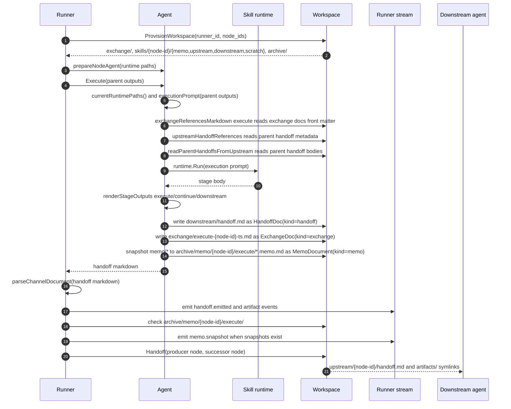
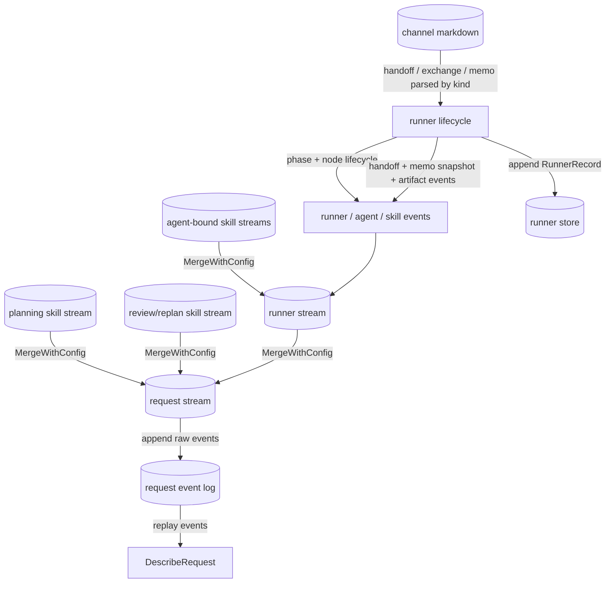

# Exchange 数据面与可观察性

当前代码里，跨 skill、跨 node、跨 request 观察层之间的共同载体已经比较统一：核心是带 front matter 的 channel markdown document，外围是 workspace、stream merge 和 append-only persistence。

## exchange / handoff / memo 是三类 channel document

定义位置：

- `internal/engine/runner/exchange_doc.go`
- `internal/engine/runner/handoff_doc.go`
- `internal/engine/runner/memo.go`

三类 document 都由两部分组成：

- YAML front matter：放结构化元数据
- markdown 正文：放 skill 产出的自然语言内容或 memo 快照正文

默认 stage 会复用同一组装逻辑，只改变 handoff 的 intent / to_nodes：

- `polish`：`intent: review`，`to_nodes: [orchestrator]`
- `execute`：`intent: continue`，`to_nodes: [downstream]`
- `report`：`intent: summarize`，`to_nodes: [orchestrator]`

此外，orchestrator planning 会生成一份 bootstrap handoff，作为初始 skill 的上游输入，而不是特例化的 exchange。

## front matter 里有哪些关键字段

三类 document 共享 `kind`、`version`、`runner_id`、`created_at`。`kind` 是路由契约：

- `kind: exchange`：共享上下文，关键字段是 `node_id`、`skill_name`、`title`
- `kind: handoff`：定向交接，关键字段是 `from_node`、`to_nodes`、`intent`、`artifacts`
- `kind: memo`：私有 memo 快照，关键字段是 `node_id`、`skill_name`、`path`

handoff 的 `intent` 用于说明下一跳语义，当前常见值有：

- `review`
- `continue`
- `summarize`

`artifacts` 用于声明 handoff 携带的文件或目录。runner 会解析这些 artifacts，把 producer node 的 `downstream/artifacts/` 下的内容通过 successor 的 `upstream/<producer-node-id>/artifacts/` 交给 downstream agent；如果 artifacts 目录不存在则跳过 symlink，producer node 失败时不会进入 successor handoff 传递。

## 谁负责生成和补齐 channel document

### Agent

`internal/engine/agent_stage_output.go` 负责默认 stage 输出：

- 用 stage body 组装 `HandoffDoc`，写入当前 node 的 `downstream/handoff.md`
- 用同一份 stage body 组装 `ExchangeDoc`，写入 runner 共享的 `exchange/`
- 调用 `snapshotMemos`，把当前 skill `memo/` 下的文件包装成 `MemoDocument` 并写入 `archive/memo/<node>/<stage>/`

因此 skill 的一次 stage 输出会同时投影成三种数据面：共享 exchange、定向 handoff、私有 memo 快照。agent 返回给 runner 的普通 stage 结果是 handoff markdown；exchange 和 memo 通过 workspace 文件被后续 prompt、审计和可观察性读取。

### Runner

runner 不解释业务语义，但会做四件基础工作：

1. 为每个 task 创建 `exchange/`、`skills/<node>/{memo,upstream,downstream,scratch}`、`archive/` 等 workspace。
2. 解析 agent 返回的 handoff markdown，并发出 `handoff.emitted` / artifact 相关 stream event。
3. 在 node 完成后检查 memo archive，并发出 `memo.snapshot` stream event。
4. 将 producer node 的 `downstream/handoff.md` 和 `downstream/artifacts/` symlink 到 successor 的 `upstream/<producer-node-id>/`。

这也是为什么 runner 能做 observability、handoff 传递和 memo 审计，而不用理解具体业务内容。

## 一个 task 周期内三类 document 的 assembly 与调用关系

下面的 sequence diagram 展示最常见的 `execute` 周期。`polish` / `report` 使用同一个 `renderStageOutputs` 组装路径，只是 handoff 的 `intent` 和 `to_nodes` 不同。为了保持图可读，Ex/WS 之间读写的具体内容放在图后的文本说明。

### execute 周期中的主要函数读写

- `Runner.prepareNodeAgent(...)` 把 `AgentRuntimePaths` 注入 agent。这里的路径包括 `ExchangeDir`、`UpstreamDir`、`DownstreamDir`、`MemoDir`、`ArchiveMemoDir` 和 `AccessibleDirs`，后续 Ex/WS 交互都通过这些路径发生。
- `Agent.executionPrompt(parentOutputs)` 会组装 skill prompt：
  - `exchangeReferencesMarkdown("execute")` 扫描 `ExchangeDir` 下的 `*.md`，只读取 exchange front matter，输出给 skill 的引用行包含文件路径、`node_id`、`skill_name`、`title`、`created_at`。这一步只告诉 skill 有哪些共享 exchange 可查，不把正文直接塞进 prompt。
  - `upstreamHandoffReferences()` 扫描 `UpstreamDir/<parent-node-id>/handoff.md`，读取 handoff front matter，输出给 skill 的引用行包含来源 node、handoff 路径、`intent`、`to_nodes`、`created_at` 和 `artifacts` 列表。
  - `readParentHandoffsFromUpstream()` 读取同一批 upstream handoff 文件的正文；如果文件是 canonical handoff markdown，会先 `ParseHandoffMarkdown` 再取 `Body`，最后按 parent node 分组写入 prompt 的 parent handoff 区块。
- `Agent.renderStageOutputs(...)` 使用 skill 返回的 stage body 同时生成三类投影：
  - `HandoffDoc{FromNode, ToNodes, Intent, Body}` → `DownstreamDir/handoff.md`，并把同一份 handoff markdown 作为 agent 返回值交给 runner。
  - `ExchangeDoc{NodeID, SkillName, Title: stage, Body}` → `ExchangeDir/<stage>-<node-id>-<timestamp>.md`，作为共享 exchange。
  - `snapshotMemos(stage, paths)` 遍历 `MemoDir` 的普通文件，跳过目录和 symlink，把每个 memo 文件包装成 `MemoDocument{NodeID, SkillName, Path, Body}` 后写到 `ArchiveMemoDir/<stage>/<relative-path>.memo.md`。
- `Runner.emitChannelDocumentEvents(...)` 只解析 agent 返回值。普通 stage 返回的是 handoff markdown，所以 runner 会发出 `handoff.emitted` 和 artifact event；exchange markdown 已经在 workspace 中作为共享文件存在，不依赖这个返回值。
- `Runner.emitMemoSnapshotEvent(...)` 检查 `archive/memo/<node-id>/<stage>/` 是否有 snapshot 文件；有文件时发出 `memo.snapshot`，没有 memo 文件时不发事件。
- `Runner.deliverHandoffToSuccessor(...)` 调用 `Workspace.Handoff(producer, successor)`，把 producer 的 `downstream/handoff.md` 和可选 `downstream/artifacts/` symlink 到 successor 的 `upstream/<producer-node-id>/`。如果 artifacts 目录不存在会跳过；如果 producer node 执行失败，runner 不会进入 successor handoff 传递。

## stream merge 现在怎么分层

当前的 stream 分层是：

- request stream：最外层观察面，由 `StartRequest` 创建
- planning / planner skill stream：由 orchestrator 绑定 skill runtime 后创建，并 merge 到 request stream
- runner stream：由 `runner.New()` 创建，并 merge 到 request stream
- agent 绑定后的 skill runtime stream：在 runner 执行节点时 merge 到 runner stream

因此外部订阅 `Response.Stream` 时，看到的是 request 级聚合视图；订阅单个 runner stream 时，看到的是更聚焦的 runner / agent / skill 事件。

## 持久化层各存什么

### request event log

- 存的是 request stream 的原始事件
- 用于 `DescribeRequest` / `ReplayDescribeView`
- 视角偏 request：适合重建 runner id、phase、节点状态和 artifacts

### runner store

- 存的是 runner append-only record
- 记录类型分为 `init`、`status`、`event`
- 当 `RunnerEvent.Data` 是 canonical exchange markdown 时，持久化编码会写成 `data_encoding=markdown` 并保留原始 markdown 到 `data_text`

这两套持久化不是重复实现，而是面向两个不同查询面：request 视角重放和 runner 视角审计。

## DescribeView 是怎么来的

`DescribeRequest` 不直接读取 live runner。它会重放 request event log，把这些事件聚合成 `DescribeView`：

- `runner_id`
- `phase`
- `status`
- `nodes`
- `artifacts`

因此 describe 面是 event-sourced 的结果，不依赖内存中的 orchestrator / runner 仍然存活。

## 当前应该如何理解数据面

一句话总结：

- exchange / handoff / memo markdown 是节点之间的业务载体
- stream 是运行时传播和观察载体
- event log / runner store 是重放和审计载体

三者不是替代关系，而是同一份运行事实在不同层面的投影。
