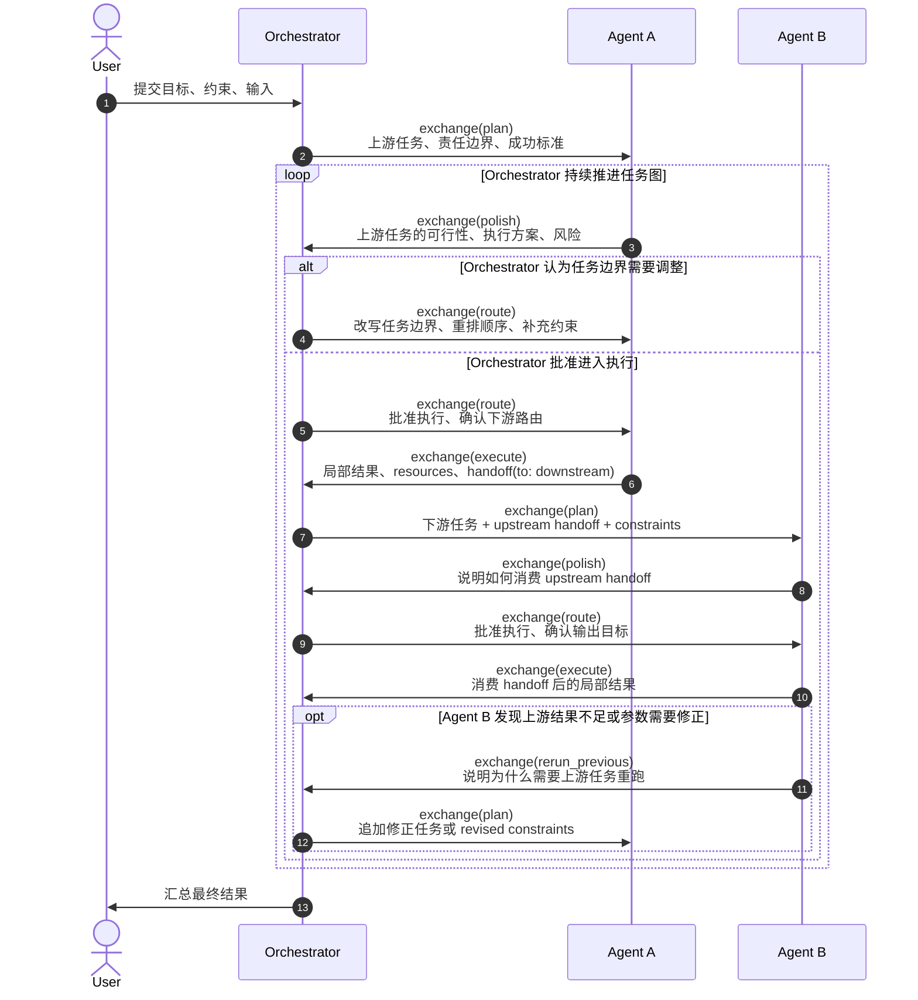

# Orchestrator / Agents exchange 编排图

这张图只保留软件工程层面的两个角色：`Orchestrator` 和多个 `Agents`。其它运行时细节不出现在图里；它们只通过 exchange document 体现为协议边界。

这张时序图里，起点是 `User -> Orchestrator`，终点是 `Orchestrator -> User`。中间通过一个最小的 `Agent A -> Orchestrator -> Agent B` 例子，把 `handoff` 如何连接 agent 之间的协作关系显式画出来了。

## 分工边界

| 角色           | 负责什么                                                                                                      | 不负责什么                                                                        |
| -------------- | ------------------------------------------------------------------------------------------------------------- | --------------------------------------------------------------------------------- |
| `Orchestrator` | 理解用户目标；拆分任务；选择和排列 `Agents`；审批 polish 结果；处理 `rerun_previous`；汇总最终结果         | 不执行具体领域工作；不把局部执行细节写进自己的控制逻辑                            |
| `Agents`    | 承接明确边界内的任务；给出 polish 可行性判断；执行任务；产出 exchange；声明 artifacts / handoffs / rerun 请求 | 不决定全局编排；不替其它 agent 改 plan；不绕过 exchange 直接改全局状态         |
| exchange       | 承载任务边界、阶段产物、资源声明、handoff 意图和修正请求                                                      | 不拥有业务决策；不替代 `Orchestrator` 的编排判断，也不替代 `Agents` 的执行判断 |

## handoff 如何连接 agents

- 上游 agent 不会直接调用下游 agent；它只在自己的 `exchange(execute)` 里写出 `handoff`。
- `Orchestrator` 读取这个 `handoff`，决定是否让某个下游 agent 继续推进，并把 `upstream handoff` 连同新的任务边界一起发给下游。
- 下游 agent 消费的是 `Orchestrator` 转发后的 `handoff` 上下文，而不是共享某个内部对象。
- 如果下游 agent 认为上游 `handoff` 不够用，它返回 `rerun_previous`，由 `Orchestrator` 决定是否让上游重跑。

## 协作原则

- `Orchestrator` 通过 exchange 把任务边界交给 `Agents`，而不是把内部控制状态暴露给它们。
- `Agents` 通过 exchange 返回可审阅、可持久化、可交给后续步骤继续使用的结果。
- 如果某个 `Agents` 成员认为前置输入需要重跑，它只提交 `rerun_previous` exchange；是否追加修正任务仍由 `Orchestrator` 决定。
- 任务编排的稳定接口是 exchange，不是临时返回值或某个内部对象。
