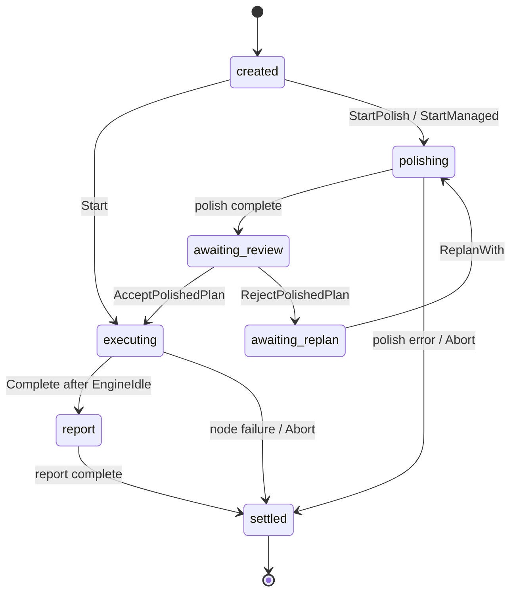

# Runner 生命周期

当前代码里，`internal/engine/runner.Runner` 同时承担 DAG 执行器和 managed lifecycle 宿主两种角色。旧文档里把 `ru` 和 managed wrapper 分开讲，已经不适合现在的实现。

## 两条入口

### bare 入口

- `Runner.Start(ctx)`
- 直接从 `created` 进入 `executing`
- 跳过 `polishing` 和 `awaiting_review`
- 适合已经确认 plan、只想跑 DAG 的场景

### managed 入口

- `Runner.StartManaged(ctx)`
- runner 自己驱动 polish、review、replan、execute、report、settle
- orchestrator 的 `StartRequest` 默认走这条路径

## phase 和 status 是两套维度

`RunnerPhase` 表示业务阶段，`RunnerStatus` 表示运行状态，两者是正交的。

当前 phase 如下：

- `created`
- `polishing`
- `awaiting_review`
- `awaiting_replan`
- `executing`
- `report`
- `settled`

当前 status 如下：

- `pending`
- `running`
- `idle`
- `failed`
- `canceled`

外部如果只想知道 runner 现在在做哪一段流程，应该看 phase；如果只想知道 engine 是否正在跑、是否失败，应该看 status。

## managed lifecycle 的实际顺序

`StartManaged` 现在的主流程是：

1. `StartPolish(ctx)`
2. 等待 phase 变成 `awaiting_review`
3. 调用 `reviewPolishedPlan(ctx)`
4. 如果 review 通过，则 `AcceptPolishedPlan(ctx, r.Plan())`
5. 如果 review 拒绝，则 `RejectPolishedPlan(reason)`
6. 调用 `replanPolishedPlan(ctx, reason)` 生成新 plan 和新 nodes
7. `ReplanWith(ctx, plan, nodes)`，重新进入 `polishing`
8. 重复 review 循环，直到通过
9. 进入 engine 执行阶段，直到 engine idle
10. `Complete(ctx)` 触发 report stage，最终 settle

这个流程的重要点是：review 和 replan 已经是 runner 自己管理的生命周期的一部分，而不只是文档里的概念边界。

## polish、execute、report 分别是谁驱动的

- `StartPolish` 会并发调用每个 node 的 `Executor.Polish`，收集 `PolishFragments()`。
- engine loop 在 `executing` 阶段调度依赖已满足的 node，调用 `Executor.Execute`。
- `Complete` 会进入 `report` phase，并发调用每个已完成 node 的 `Executor.Report`，收集 `ReportSummaries()`。

每个阶段的默认返回值都已经被约束为 markdown exchange document，而不是任意 Go 值。

## executor 和 session binding

runner 现在自己管理 skill session 复用：

1. `prepareNodeExecutors` 先为每个 executor 绑定持久 session id。
2. 真正执行前，`prepareNodeExecutor` 会带着最新的 accessible dirs 再绑定一次 runtime。
3. runtime skill 的 event stream 会在这个时点 merge 进 runner event stream。

之所以把 stream merge 推迟到真正执行前，是为了避免先 merge 一个临时 runtime stream，再被后续 re-bind 替换，导致订阅泄漏。

## runner event stream 暴露什么

runner-owned stream 现在承担三类事件：

- runner 级 phase / node lifecycle 事件
- executor 级 stage 事件，例如 polish started / report completed
- skill 级衍生事件，例如 memo delta 和 artifact created

这条 stream 既能给 orchestrator merge 到 request stream，也能被 `SubscribeRunnerStream` 直接订阅。

## settle 之后留下什么

- `Runner.View()` 提供 point-in-time snapshot
- `Runner.Wait(ctx)` 返回最终 engine error
- `RunnerStore` 里保留 append-only 记录
- request event log 里保留 request 视角的 stream 事件

所以 settle 不是“信息结束”，只是 live lifecycle 结束。